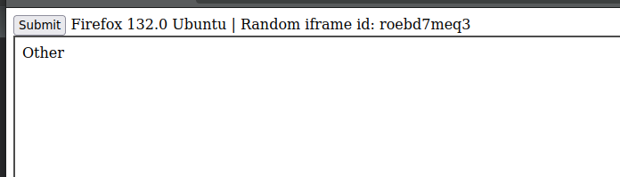
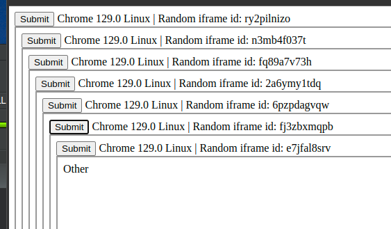
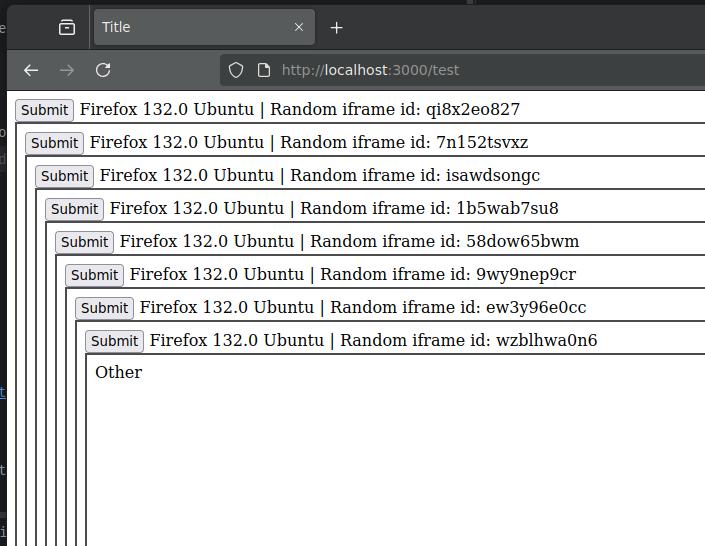
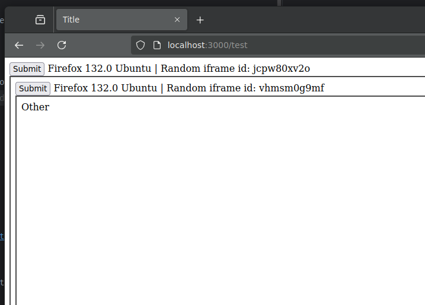

# Firefox 132 Nested Iframes from form actions bug

When more than two iframes loaded from forms with the same action are nested, after the second one, no additional iframe loads.

This issue occurs starting from the beta version of Firefox 132.0 (r20241018091619).

In the previous nightly version 132.0 (r20240908211800), this issue did not occur.

## Assumption: 
I believe Firefox is not considering the data sent via POST form to determine whether it should nest the iframe or not (it only does so based on the action URL).

## Workaround:
As workaround, if you add a random query parameter to the action URL (e.g. `?[random]`), it successfully loads indefinitely.

Add `?IFRAME_NAME_PLACEHOLDER` at the end of the action URL in the `test.html` file to test this.

## Reproduce the issue:
To reproduce this issue, use the following commands:

```bash
npm install
```

```bash
node server.js
```

Open firefox 132.0 and navigate to http://localhost:3000/test


- Push the button `Submit` and check the iframe content

| Chrome                                 | Firefox 132.0 nightly                    | Firefox 132.0 beta (or later)                                                                                          |
|----------------------------------------|------------------------------------------|------------------------------------------------------------------------------------------------------------------------|
| 129.0                                  | 132.0 nightly Sept 08                    | 132.0 beta Oct 18                                                                                                      |              |
| You can nest infinite iframes.         | You can nest infinite iframes.           | **You can only nest two iframes.**<br/>if you try to nest more, the second iframe won't load (the form doesn't submit) |              |
|  |  |                                                                                      |
